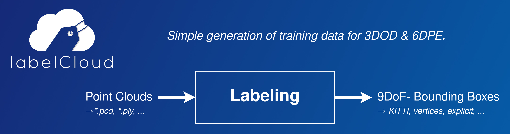

# Introduction to labelCloud

labelCloud is a lightweight tool for labeling 3D bounding boxes in point clouds.



It is written in Python and can be installed via `pip` (see [Setup](setup.md)).

## Labeling
labelCloud supports two different ways of labeling (*picking* & *spanning*) as well as multiple
mouse and keyboard options for subsequent correction.


(There is also a [short YouTube-Video](https://www.youtube.com/watch?v=8GF9n1WeR8A) that introduces
the tool.)

### Picking Mode

* Pick the location of the bounding box (front-top edge)
* Adjust the z-rotation by scrolling with your mouse wheel

### Spanning Mode

* Subsequently span the length, width and height of the bounding box by selecting four vertices
* The layers for for the last two vertices (width & height) will be locked to allow easy selection

### Correction

* Use the buttons on the left-hand side or shortcuts to correct the *translation*, *dimension* and
  *rotation* of the bounding box
* Resize the bounding box by holding your cursor above one side and scrolling with the mouse wheel

By default the x- and y-rotation of bounding boxes will be prohibited.
For labeling **9 DoF-Bounding Boxes** deactivate `z-Rotation Only Mode` in the menu, settings or
`config.ini` file.
Now you will be able to rotate around all three axes.

If you have a point clouds with objects that keep their positions over multiple frames, you can
activate the *Propagate Labels* feature in the Labels menu or `config.ini`.

## Import & Export Options
labelCloud is built for a versatile use and aims at supporting all common point cloud file formats
and label formats for storing 3D bounding boxes.
The tool is designed to be easily adaptable to multiple use cases. The welcome dialog will ask for
the most common parameters (mode, classes, export format).

For more configuration, edit the corresponding fields in `labels/_classes.json` for label
configuration or `config.ini` for general settings (see [Configuration](configuration.md)) for a
description of all parameters).

### Supported Point Cloud Formats

| Type      | File Formats                          |
| --------- | ------------------------------------- |
| Colored   | `*.pcd`, `*.ply`, `*.pts`, `*.xyzrgb` |
| Colorless | `*.xyz`, `*.xyzn`, `*.bin` (KITTI)    |

### Supported Label Formats

| Label Format          | Description                                                                                                                                                                |
| --------------------- | -------------------------------------------------------------------------------------------------------------------------------------------------------------------------- |
| `centroid_rel`        | Centroid `[x, y, z]`; Dimensions `[length, width, height]`; <br> Relative Rotations as Euler angles in radians (-pi..+pi) `[yaw, pitch, roll]`                             |
| `centroid_abs`        | Centroid `[x, y, z]`; Dimensions `[length, width, height]`; <br> Absolute Rotations as Euler angles in degrees (0..360°) `[yaw, pitch, roll]`                              |
| `vertices`            | 8 Vertices of the bounding box each with `[x, y, z]` (see [Conventions](conventions.md) for order)                                                                         |
| `kitti`               | Centroid; Dimensions; z-Rotation (See [specification](https://github.com/bostondiditeam/kitti/blob/master/resources/devkit_object/readme.txt)); Requires calibration files |
| `kitti_untransformed` | See above, but without transformations (if you just want to use the same label structure).                                                                                 |

You can easily create your own exporter by subclassing the abstract [BaseLabelFormat](https://github.com/ch-sa/labelCloud/blob/master/labelCloud/label_formats/base.py#L10).
All rotations are counterclockwise (i.e. a z-rotation of 90°/π is from the positive x- to the negative y-axis!).


## Usage & Attribution
When using the tool feel free to drop me a mail with feedback or a description of your use case
(christoph.sager[at]gmail.com).
If you are using the tool for a scientific project please consider citing our publications:


!!! quote "Academic Publications"

    Sager C., Zschech P., Kühl N.:
    labelCloud: A Lightweight Labeling Tool for Domain-Agnostic 3D Object Detection in Point Clouds
    In: Computer-Aided Design and Applications 19 (2022), p. 1191-1206
    ISSN: 1686-4360
    DOI: [10.14733/cadaps.2022.1191-1206](https://dx.doi.org/10.14733/cadaps.2022.1191-1206)
    URL: [http://cad-journal.net/files/vol_19/CAD_19(6)_2022_1191-1206.pdf](http://cad-journal.net/files/vol_19/CAD_19(6)_2022_1191-1206.pdf)
    
    ```bibtex
    @article{Sager_2022,
        doi = {10.14733/cadaps.2022.1191-1206},
        url = {http://cad-journal.net/files/vol_19/CAD_19(6)_2022_1191-1206.pdf},
        year = 2022,
        month = {mar},
        publisher = {{CAD} Solutions, {LLC}},
        volume = {19},
        number = {6},
        pages = {1191--1206},
        author = {Christoph Sager and Patrick Zschech and Niklas Kuhl},
        title = {{labelCloud}: A Lightweight Labeling Tool for Domain-Agnostic 3D Object Detection in Point Clouds},
        journal = {Computer-Aided Design and Applications}
    }
    ```

    Sager C., Zschech P., Kühl N.:
    labelCloud: A Lightweight Domain-Independent Labeling Tool for 3D Object Detection in Point Clouds
    International CAD Conference (Barcelona, 5. July 2021 - 7. July 2021)
    In: Proceedings of CAD’21 2021
    DOI: [10.14733/cadconfP.2021.319-323](https://dx.doi.org/10.14733/cadconfP.2021.319-323)
    ```bibtex
    @misc{sager2021labelcloud,
      title={labelCloud: A Lightweight Domain-Independent Labeling Tool for 3D Object Detection in Point Clouds}, 
      author={Christoph Sager and Patrick Zschech and Niklas Kühl},
      year={2021},
      eprint={2103.04970},
      archivePrefix={arXiv},
      primaryClass={cs.CV}
    }
    ```

## Acknowledgment
I would like to thank the [Robotron RCV-Team](https://www.robotron.de/rcv) for the support in the
preparation and user evaluation of the software.
The software was developed as part of my diploma thesis titled "labelCloud: Development of a
Labeling Tool for 3D Object Detection in Point Clouds" at the
[Chair for Business Informatics, especially Intelligent Systems](https://tu-dresden.de/bu/wirtschaft/winf/isd)
of the TU Dresden. The ongoing research can be followed in our
[project on ResearchGate](https://www.researchgate.net/project/Development-of-a-Point-Cloud-Labeling-Tool-to-Generate-Training-Data-for-3D-Object-Detection-and-6D-Pose-Estimation).
